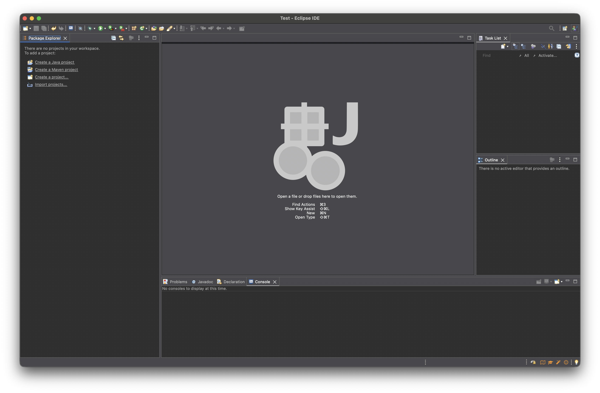
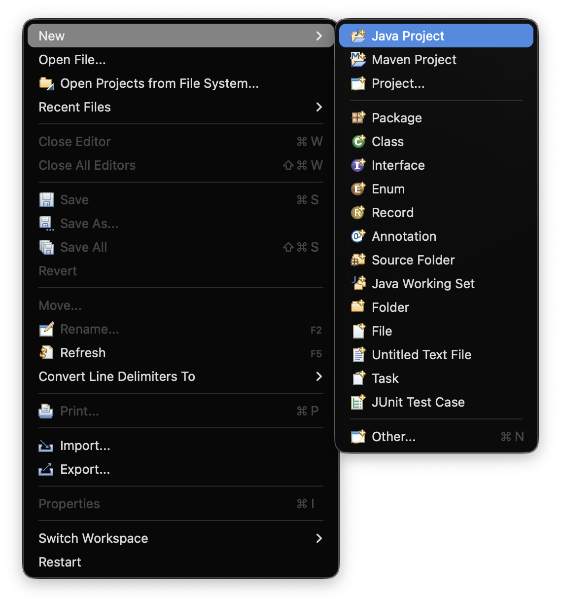
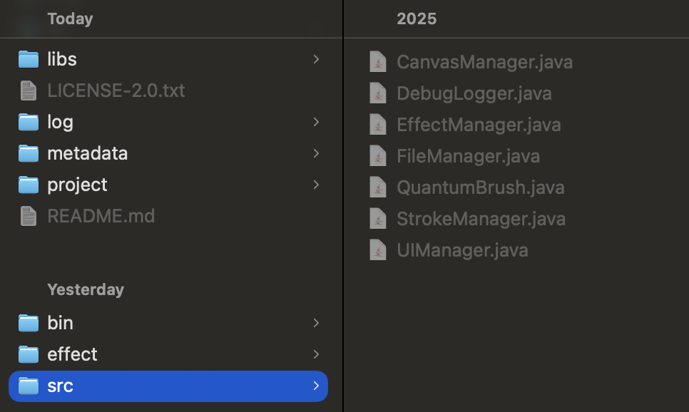

# Welcome to the source code of Quantum Brush!

Writer: Astryd Park

## Technical Description

Quantum Brush is a standalone Java application with `Processing (Java)` framework and `conda` environment's `Python 3.11+` as its backend. It's built with `OpenJDK`:

``` bash
(base) astrydpark@Astryds-MacBook-Pro ~ % java -version
    openjdk version "21.0.7" 2025-04-15 LTS
    OpenJDK Runtime Environment Temurin-21.0.7+6 (build 21.0.7+6-LTS)
    OpenJDK 64-Bit Server VM Temurin-21.0.7+6 (build 21.0.7+6-LTS, mixed mode, sharing)
```

After clone this repository, you can edit the code and build an app from scratch to test your contribution. Using [`Eclipse IDE`](https://eclipseide.org/) is highly recommended. I used `2025-03` version.

<details>

<summary> If you want to bring only `.java` files </summary>

To make the source code as an executable Java project in Eclipse IDE, two main steps are required. One is adding Processing 4's core library, which is shipped with its license and the source code in this repository, to the project's build path. The other is import the source codes from `src` folder into the IDE. Since Eclipse IDE doesn't naturally recognise the collection of `.java` files as a Java project, you need to follow the instructions.

### Step 1: Let's make these raw Java files recognisable as a Java project.

After you download Eclipse IDE, underneath your `$HOME` folder, you can see there is a folder named `eclipse-workspace`. This is the easiest place to start but you can choose any directory as a workplace. In my case, I choose the easiest option, and made the folder called `Test` inside `eclipse-workspace`.


After this, you will see the fresh window like this.



Let's create a Java project. If you put a cursor on 'File', you can select the option.



Set the project name as `QuantumBrush` (why not?), uncheck `Use default location` and choose `src` folder from the cloned repository. Uncheck `Create module-info.java file` too. Press `Finish`.




After that, you can see the Java project is created based on the source code. But there's an issue. You would witness that there are so many red warnings. It's because the project doesn't know where to reference to get Processing (Java) framework.

### Step 2: Let's make Processing 4 recognisable as a reference.

If you open up the Package Explorer, you can see underneath `QuantumBrush`, there's `default package`, and if you open it up, you can see the source code (`.java` codes).

Oh, and don't forget to download Processing 4 from its [official website](https://processing.org/download).

- Hard way: Now, browse through this path on the Finder window: `Applications/Processing/Contents/app/resources/core/library/core-4.4.1.jar`. To find the `Contents` on the Applications window, right-click the `Processing` icon, and select `Show Package Contents`.
- Shortcut for you: You can actually reference the `lib` folder in the cloned repository, and copy the `core-4.4.1.jar` file from there.


Press `cmd + c` to copy the core JAR file. After that, go back to Eclipse, `cmd + v` to paste the file on the `Package Explorer` window after click `QuantumBrush`.


Now, right-click the `core-4.4.1.jar` and select `Build Path` > `Add to Build Path`.

And that's pretty much it! Now you can build the Java project.

### One more thing...

When you build the app you might see the error regarding Python configuration. It's fine, just go to the Python Configuration menu from the menu bar of Quantum Brush, select the Python file underneath your `conda` instllation path (most of the time, it's underneath `$HOME/miniconda3/envs/{yourEnvironment}/bin/python3.x`). Select the file, save the changes, and you won't see any errors afterwards.

</details>

## Acknowledgement

This repository contains Processing 4's core library, which is licensed under the GNU Lesser General Public License version 2.1 ([LGPL-2.1](https://www.gnu.org/licenses/old-licenses/lgpl-2.1.en.html)).

Here is acknowledgement from Processing organisation:

> Processing was initiated in 2001 by Ben Fry and Casey Reas, who led the development and maintenance of the project until 2023. We are grateful for their vision and dedication to the project. Processing is also indebted to over two decades of contributions from the broader Processing community.

## License

Copyright (c) 2025 [MOTH Quantum](https://www.mothquantum.com/)

Licensed under the Apache License, Version 2.0 (the "License"); you may not use this file except in compliance with the License. You may obtain a copy of the License [here](http://www.apache.org/licenses/LICENSE-2.0).

Unless required by applicable law or agreed to in writing, software distributed under the License is distributed on an "AS IS" BASIS, WITHOUT WARRANTIES OR CONDITIONS OF ANY KIND, either express or implied. See the License for the specific language governing permissions and limitations under the License.