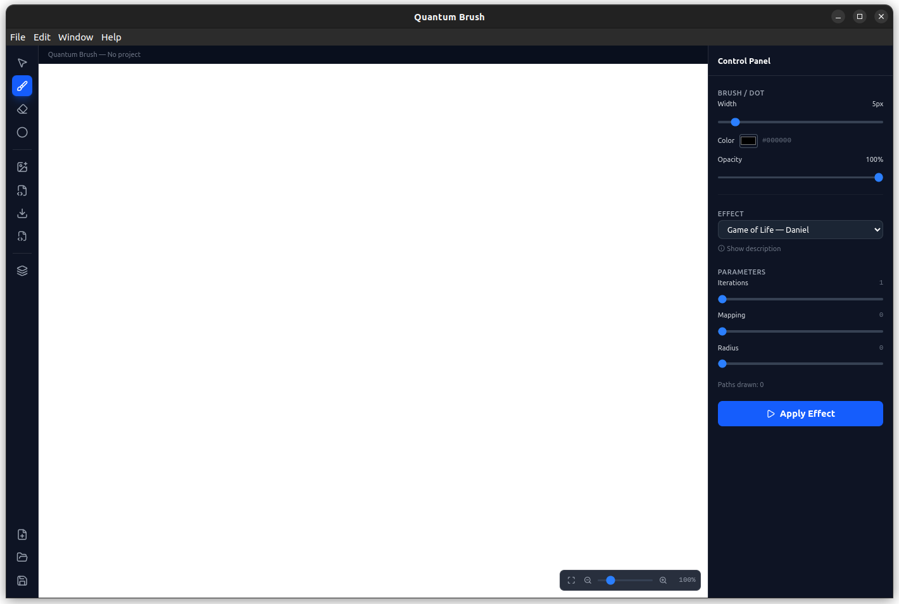
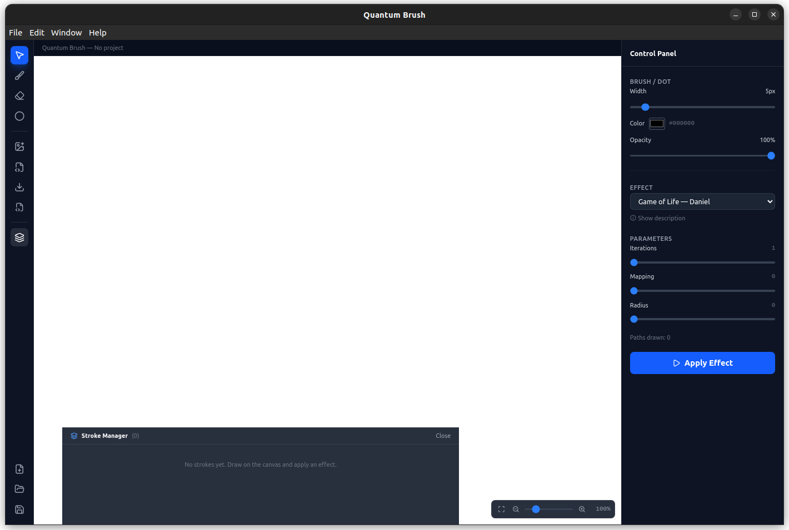

# Quantum Brush

A modern, open-source desktop application for quantum-powered digital art. Quantum Brush lets you paint with brushes driven by real quantum computing algorithms — from Heisenberg spin models to quantum cellular automata — producing visual effects that are impossible with classical computation alone.

This project is a complete rewrite of the original [Quantum Brush](https://github.com/moth-quantum/QuantumBrush) by [MOTH Quantum](https://github.com/moth-quantum), rebuilt from the ground up with a modern tech stack while preserving and extending the original quantum effect engine.



<p align="center">
  
  
</p>

---

## Tech Stack

Every technology used in this project is **free and open source**.

| Technology | Role | License |
|---|---|---|
| [Electron](https://www.electronjs.org/) | Cross-platform desktop shell | MIT |
| [React 18](https://react.dev/) | UI framework | MIT |
| [TypeScript](https://www.typescriptlang.org/) | Type-safe development | Apache-2.0 |
| [Vite](https://vite.dev/) | Build tool with HMR | MIT |
| [Fabric.js 7](http://fabricjs.com/) | HTML5 canvas engine | MIT |
| [Tailwind CSS 4](https://tailwindcss.com/) | Utility-first styling | MIT |
| [Zustand](https://zustand.docs.pmnd.rs/) | Lightweight state management | MIT |
| [Qiskit](https://github.com/Qiskit/qiskit) | Quantum circuit simulation | Apache-2.0 |
| [Qiskit Aer](https://github.com/Qiskit/qiskit-aer) | Statevector simulator backend | Apache-2.0 |
| [PennyLane](https://pennylane.ai/) | Quantum ML framework | Apache-2.0 |
| [JAX](https://github.com/jax-ml/jax) | Differentiable computation | Apache-2.0 |
| [NumPy](https://numpy.org/) | Numerical computation | BSD |
| [SciPy](https://scipy.org/) | Scientific utilities | BSD |
| [Electron Builder](https://www.electron.build/) | Packaging (macOS, Windows, Linux) | MIT |

---

## Features

### Canvas & Drawing Tools

- **Brush** — Free-drawing with configurable color, width, and opacity
- **Eraser** — Remove drawn objects from the canvas
- **Dot** — Place single points for point-based quantum effects
- **Select** — Move, resize, and delete objects on the canvas
- **Zoom** — Scroll-wheel zoom (0.1x to 20x)
- **Pan** — Space + drag to navigate the canvas
- **Undo / Redo** — Full history stack (up to 20 states)

### Import & Export

| Format | Import | Export |
|---|---|---|
| PNG | Yes | Yes |
| JPEG | Yes | Yes |
| SVG | Yes | Yes |
| GIF / BMP / WebP | Yes | — |
| `.qbrush` (project file) | Yes | Yes |

- **Drag and drop** support for images and SVGs directly onto the canvas
- **Native file dialogs** for all import/export operations
- **Per-stroke SVG archival** for effect execution history

### Project Management

- Create new projects with custom canvas dimensions
- Save and open `.qbrush` project files
- Internal project storage with metadata and stroke history

### Keyboard Shortcuts

| Shortcut | Action |
|---|---|
| `V` | Select tool |
| `B` | Brush tool |
| `E` | Eraser tool |
| `D` | Dot tool |
| `Ctrl+Z` | Undo |
| `Ctrl+Y` | Redo |
| `Ctrl+S` | Save |
| `Ctrl+0` | Reset zoom |
| `Ctrl+-` / `Ctrl+=` | Zoom out / in |
| `Space + Drag` | Pan canvas |
| `Delete` / `Backspace` | Delete selected objects |

---

## Quantum Brushes & Effects

Each effect runs a real quantum algorithm on the pixel data. Effects are dynamically loaded as plugins from the `python/` directory.

### 1. Basic (Acrylic)
**Author:** MOTH
Paints a uniform color on the canvas. The non-quantum baseline brush with configurable radius, color, opacity, and edge blur.

### 2. Smudge (Damping)
**Author:** Joao
Mixes colors using **quantum amplitude damping/pumping channels**. Each stroke segment is encoded as a qubit state, evolved through controlled rotation gates simulating energy exchange, and decoded back into shifted HLS colors.

### 3. Collage (Clone)
**Author:** Joao
Copies and pastes image regions subject to the **quantum no-cloning theorem**. Uses an asymmetric universal cloning circuit to produce two imperfect copies — the fidelity trade-off is governed by quantum mechanics.

### 4. Aquarela (QDrop)
**Author:** Joao
A watercolor brush that mixes a target color with canvas colors using **quantum entanglement**. Controlled rotations entangle paint drops with an ancilla qubit, producing non-classical color correlations.

### 5. Heisenbrush (Continuous)
**Author:** Arianna
Simulates color shifts through the **Heisenberg spin model**. A chain of qubits evolves under the Heisenberg Hamiltonian (XX + YY + ZZ interactions), and mean magnetization measurements drive smooth color transformations along the stroke.

### 6. Heisenbrush (Discrete)
**Author:** Arianna
Multi-stroke variant of the Heisenbrush. Each stroke segment independently evolves through the **Heisenberg model**, producing discrete, physics-inspired color variations. Limited to 10 strokes.

### 7. Game of Life (GoL)
**Author:** Daniel
A **quantum cellular automaton** inspired by Conway's Game of Life. Each pixel's color is encoded as a qubit and evolved through a 9-qubit neighbourhood circuit. The reduced density matrix determines the new color via partial trace.

### 8. Chemical
**Authors:** Ali, Henrique Ennes & Jui-Ting Lu (Luminists)
Uses intermediate steps of the **Variational Quantum Eigensolver (VQE)** to simulate H2 molecules. Pre-computed VQE circuits transform pixel colors, mapping molecular ground-state optimization onto visual effects.

### 9. Quantum Pointillism
**Authors:** Khrystian Koci & Benjamin Thomas
Places dots along the stroke path with quantum-correlated colors via the **Ising model**. Trotterized time evolution creates correlations between neighbouring dots — ferromagnetic (similar) or antiferromagnetic (contrasting).

### 10. Steerable
**Authors:** Chih-Kang Huang & Jui-Ting Lu (Luminists)
Applies **quantum geometric control theory** to steer one image region's colors toward another. A PennyLane circuit is trained via JAX optimization to find the unitary transformation between source and target states.

---

## Getting Started

### Prerequisites

- **Node.js** >= 18
- **Python** >= 3.9
- **npm**

### Clone the Repository

```bash
git clone https://github.com/Akri-A/QuantumBrush_App.git
cd QuantumBrush_App
```

### Install Frontend Dependencies

```bash
npm install
```

### Install Python Dependencies

```bash
pip install numpy pillow qiskit qiskit-aer scipy pennylane jax
```

> The app checks for missing Python packages on startup and will notify you if any are missing.

### Run in Development Mode

```bash
npm run dev
```

This starts Vite's dev server with hot module replacement and launches the Electron window.

### Build for Production

```bash
npm run build
```

This compiles TypeScript, bundles with Vite, and packages the desktop app with Electron Builder. Output targets:

- **macOS** — `.dmg`
- **Windows** — NSIS installer (x64)
- **Linux** — AppImage

---

## Project Structure

```
QuantumBrush_App/
├── electron/              # Electron main process
│   ├── main.ts            # Window, menus, IPC handlers
│   ├── preload.ts         # Secure contextBridge API
│   └── python.ts          # Python subprocess management
├── src/                   # React renderer
│   ├── App.tsx            # Root layout
│   ├── store.ts           # Zustand global state
│   ├── types.ts           # TypeScript definitions
│   └── components/
│       ├── CanvasArea.tsx      # Fabric.js canvas, drawing tools
│       ├── Sidebar.tsx         # Left toolbar
│       ├── ControlPanel.tsx    # Right panel, effect parameters
│       ├── StrokeManager.tsx   # Bottom drawer, stroke history
│       ├── ProjectDialog.tsx   # Project creation modal
│       └── Notification.tsx    # Toast notifications
├── python/                # Quantum effect plugins
│   ├── apply_effect.py    # Effect execution engine
│   ├── utils.py           # Shared utilities
│   ├── acrylic/           # Basic brush
│   ├── damping/           # Smudge brush
│   ├── clone/             # Collage brush
│   ├── qdrop/             # Aquarela brush
│   ├── heisenbrush/       # Heisenbrush (continuous)
│   ├── heisenbrush2/      # Heisenbrush (discrete)
│   ├── GoL/               # Game of Life
│   ├── chemical/          # Chemical brush
│   ├── pointillism/       # Quantum Pointillism
│   └── steerable/         # Steerable brush
├── design/                # Design specification
├── legacy/                # Original Java source code
├── index.html             # Vite entry point
├── vite.config.ts         # Vite + Electron plugin config
├── tailwind.config.js     # Tailwind configuration
├── electron-builder.json5 # Packaging configuration
└── package.json
```

---

## Original Project

This application is built on top of the [Quantum Brush](https://github.com/moth-quantum/QuantumBrush) project by [MOTH Quantum](https://github.com/moth-quantum), originally written in Java (OpenJDK + Processing) with a Python quantum backend.

- **Original repository:** https://github.com/moth-quantum/QuantumBrush
- **Original source branch:** https://github.com/moth-quantum/QuantumBrush/tree/source
- **Related issue:** [#32 — Improve UX/UI of the App with Code Implementation](https://github.com/moth-quantum/QuantumBrush/issues/32)

The original Java source code is preserved in the [`legacy/`](legacy/) directory for reference.

---

## License

This project is open source. See the original [Quantum Brush repository](https://github.com/moth-quantum/QuantumBrush) for license details.
