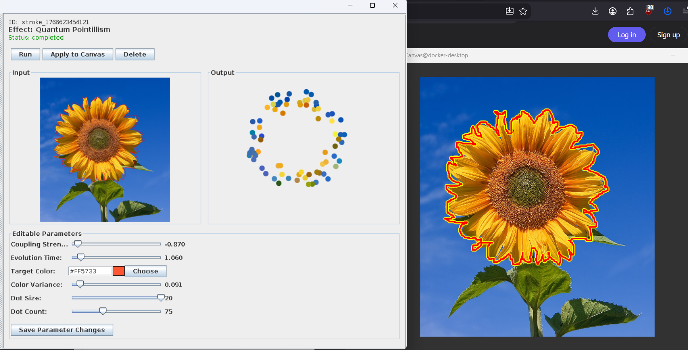
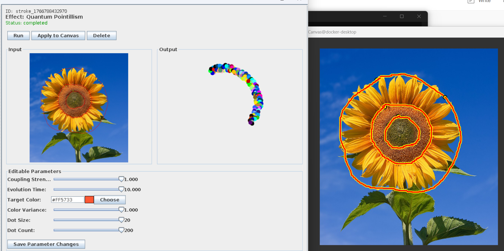

# How to Use the Quantum Pointillism Brush

A simple guide to painting with quantum-connected dots.

---

## What Does This Brush Do?

It turns your brush strokes into colorful dots - like the famous pointillism art style (think Georges Seurat). But instead of random dots, these dots "talk" to each other through quantum physics, creating unique color patterns you can't get any other way.

---

## How to Use It

### Step 1: Draw Your Stroke

Just **click and drag** on your image - anywhere you want dots to appear.

The brush follows your path, so:
- **Curved strokes** = dots follow the curve
- **Long strokes** = more dots spread along the line
- **Short strokes** = concentrated dot clusters

You can see the orange paths drawn on the canvas (left) and the parameter panel (right).

### Step 2: The Brush Does Its Magic

After you release, the brush:
1. Places dots along your path
2. Figures out which dots are neighbors
3. Runs quantum physics to make neighbor colors interact
4. Paints the final dots on your canvas

The dots pick up colors from your image underneath, but then quantum physics blends and shifts them based on your settings.

---

## The Controls That Actually Matter

You'll see a parameter panel with sliders. Here's what they do in plain English:

### **Dot Count** (10-200)
How many dots you want.
- **Low (10-30)**: Sparse, artistic, fast
- **High (100-200)**: Dense, detailed, slower

### **Coupling Strength** (-1.0 to 1.0)
This is the "quantum conversation" knob:
- **Positive (0.5 to 1.0)**: Dots blend together → smooth gradients, harmonious colors
- **Negative (-1.0 to -0.5)**: Dots push apart → contrasting colors, vibrant chaos
- **Zero (0)**: Dots ignore each other → random colors

*Above: Negative coupling (-0.67) - notice the wild color variety and contrast!*

*Above: Positive coupling (1.0) - see how dots have similar, harmonious colors*

### **Dot Size** (1-20)
How big each dot is. Pretty self-explanatory.
- Small dots = fine detail
- Big dots = bold, visible from far away

### **Evolution Time** (0.1-10.0)
How long the quantum "conversation" runs.
- **Short time (0.5-1.0)**: Colors stay closer to original image
- **Long time (5.0-10.0)**: More mixing, more quantum weirdness

### **Color Variance** (0-1.0)
Adds randomness so dots don't look identical.
- **0**: All dots in a region look the same (boring)
- **0.35** (default): Nice organic variety
- **1.0**: Maximum chaos

### **Target Color**
A color "magnet" that pulls all dots slightly toward it. Usually you can ignore this unless you want a specific color bias.

---

## Tips for Best Results

### Start Simple
Begin with these settings and adjust from there:
- Dot Count: **50**
- Coupling: **0.5** (positive for smooth, or **-0.7** for wild)
- Evolution Time: **2.0**
- Dot Size: **8**

### Experiment with Coupling
This is the most dramatic control:
- **Sunsets/Smooth gradients**: Use positive coupling (0.5-0.8)
- **Abstract/Psychedelic**: Use negative coupling (-0.5 to -1.0)
- **Pointillist portraits**: Use slightly positive (0.2-0.4)

### More Dots = Slower
- Under 30 dots: Nearly instant
- 30-100 dots: A few seconds wait
- Over 100 dots: Could take 10-30 seconds (be patient!)

### Work in Layers
- Apply multiple small strokes instead of one giant stroke
- Build up your effect gradually
- Each stroke is independent

---

## What "Brush Path" Means

This confused some people, so here's the deal:

**"Brush path" = the line you draw when you click and drag**

That's it. The dots aren't scattered randomly across your whole canvas - they follow your mouse/stylus movement. You have full control over where the dots appear.

Think of it like:
- You draw an invisible guideline
- The brush sprinkles dots along and around that guideline
- Quantum physics decides the colors

---

## Common Issues

### "Nothing is happening"
- Make sure you actually drag (not just click)
- Check if your dot count is too low
- Try making the dot size bigger

### "It's taking forever"
- You probably set dot count too high (>100)
- Wait it out, or click "Delete" and try with fewer dots
- The app should show "Status: completed" when done

### "The colors look wrong"
- Play with the coupling strength - it dramatically changes colors
- Try different evolution times
- Adjust color variance

### "I accidentally clicked the canvas while moving the window"
- Yeah, this is a known issue with QuantumBrush itself (not specific to this brush)
- Workaround: Use the title bar to move windows, not the canvas area
- If you get an accidental dot, just undo or paint over it

---

## Quick Example Workflow

1. Open an image in QuantumBrush (File → Open)
2. Select "Quantum Pointillism" from the effects menu
3. Set Dot Count to **50**, Coupling to **0.6**, Dot Size to **10**
4. Draw a curved stroke across your image
5. Wait a few seconds
6. Click "Apply to Canvas" to finalize it
7. Repeat with different strokes to build up your artwork

---

## That's It!

It's really just:
1. Draw where you want dots
2. Adjust the quantum physics knobs
3. Let the magic happen

The quantum stuff is happening behind the scenes - you don't need to understand Ising models or Bloch spheres to make cool art. Just play with the sliders and see what happens!

---

**Pro tip**: Save your favorite parameter combinations. Once you find settings you like, write them down so you can recreate that style later.
